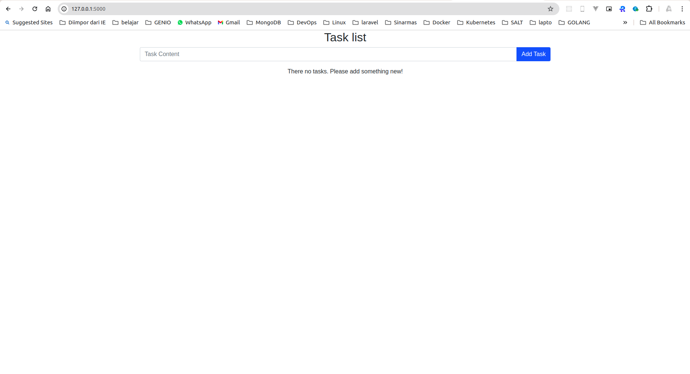
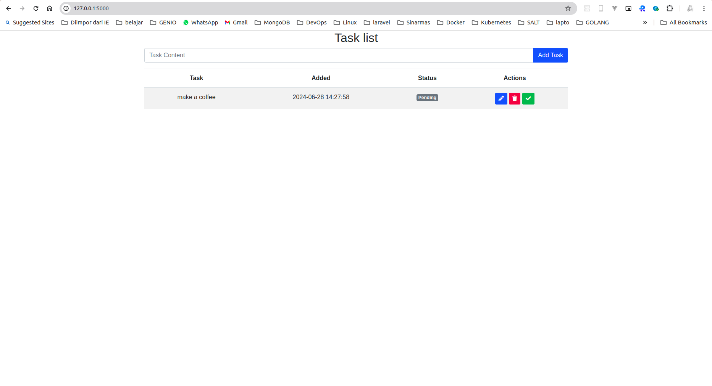
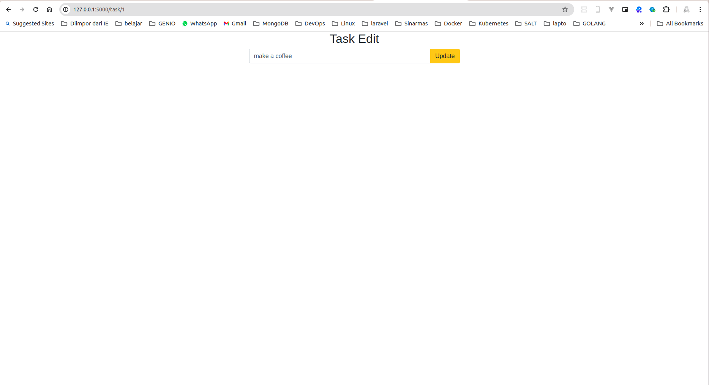
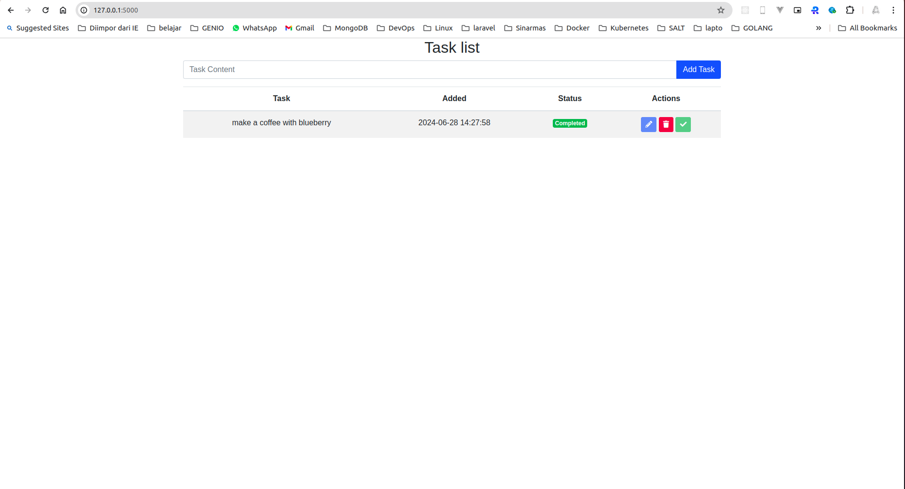

# python-flask

# TODO Application

This is a simple TODO application built using Python with the Flask framework. The application uses SQLAlchemy for ORM and SQLite for the database. It provides CRUD (Create, Read, Update, Delete) functionality for managing TODO items.

## Features

- **Create** a new TODO item
- **Read** all TODO items or a specific TODO item
- **Update** an existing TODO item
- **Delete** a TODO item

## Requirements

- Python 3.7+
- Flask
- SQLAlchemy

## Installation

1. **Clone the repository:**

    ```sh
    git clone https://github.com/yourusername/todo-app.git
    cd todo-app
    ```

2. **Create and activate a virtual environment:**

    ```sh
    python3 -m venv venv
    source venv/bin/activate  # On Windows use `venv\Scripts\activate`
    ```

3. **Install the dependencies:**

    ```sh
    pip install -r requirements.txt
    ```

4. **Initialize the database schema:**

    ```sh
    python init_db.py
    ```

## Running the Application

1. **Run the Flask application:**

    ```sh
    python app.py
    ```

2. **Open your browser and navigate to:**

    ```
    http://127.0.0.1:5000/
    ```

## Project Structure


- `app.py` - The main application file where the Flask app is defined and routes are set up.
- `init_db.py` - Script to initialize the database schema.
- `requirements.txt` - A file that lists the project dependencies.
- `templates/` - Directory for HTML templates.
- `README.md` - This file.

## API Endpoints

- `GET /` - Retrieve all TODO items.
- `GET /task/<id>` - Retrieve a specific TODO item by ID.
- `POST /` - Create a new TODO item.
- `POST /task/<id>` - Update an existing TODO item by ID.
- `POST /complete/<id>` - Complete an existing TODO item by ID.
- `DELETE /delete/<id>` - Delete a TODO item by ID.

## Example





